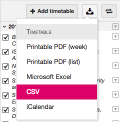
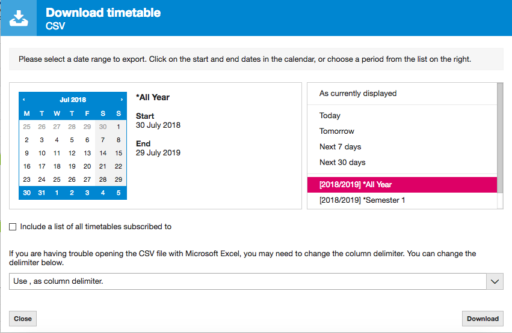

# Schedules 

### Brief
A Plymouth University timetable parser to generate a personalised schedule determined from module group numbers.


## Python prototyping

### 'groups' formatting

_e.g.:_ 
```
"module name","group number",
"another module name","your group number",
```

## Javascript implementation

### How to use the service

1. Visit [https://timetables.plymouth.ac.uk/"](https://timetables.plymouth.ac.uk/)

2. On the righthand side, click the download icon and select CSV from the dropdown options.


3. Select the following options and download the CSV file to your computer.


4. Click the Choose File button above and select the CSV file.

5. Fill out your module information, entering the module name in the lefthand text box and your group number in the righthand box.

6. If you want to e.g.: attend all events with the word "Lecture" in the name, then enter that word in the lefthand box and leave the number in the righthand box as 00.

7. Once done, click Save Grouping Changes to save and update your timetable! Change the week number in the top left corner to view different weeks.
